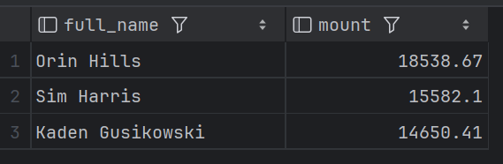

<p align="center" style="background-color:white">
 <a href="https://www.ravn.co/" rel="noopener">
 </a>
</p>
<p align="center">
 <a href="https://www.postgresql.org/" rel="noopener">
 </a>
</p>

---

<p align="center">A project to show off your skills on databases & SQL using a real database</p>

## 📝 Table of Contents

- [Case](#case)
- [Installation](#installation)
- [Data Recovery](#data_recovery)
- [Excersises](#excersises)

## 🤓 Case <a name = "case"></a>

As a developer and expert on SQL, you were contacted by a company that needs your help to manage their database which runs on PostgreSQL. The database provided contains four entities: Employee, Office, Countries and States. The company has different headquarters in various places around the world, in turn, each headquarters has a group of employees of which it is hierarchically organized and each employee may have a supervisor. You are also provided with the following Entity Relationship Diagram (ERD)

#### ERD - Diagram <br>

 <br>

---

## 🛠️ Docker Installation <a name = "installation"></a>

1. Install [docker](https://docs.docker.com/engine/install/)

---

## 📚 Recover the data to your machine <a name = "data_recovery"></a>

Open your terminal and run the follows commands:

1. This will create a container for postgresql:

```
docker run --name nerdery-container -e POSTGRES_PASSWORD=password123 -p 5432:5432 -d --rm postgres:15.2
```

2. Now, we access the container:

```
docker exec -it -u postgres nerdery-container psql
```

3. Create the database:

```
create database nerdery_challenge;
```

5. Close the database connection:
```
\q
```
C:\Users\arago\OneDrive\Escritorio\nerdery-repos\DB-Nerdery-Challenges\src\dump.sql
4. Restore de postgres backup file

```
cat /.../dump.sql | docker exec -i nerdery-container psql -U postgres -d nerdery_challenge
```

- Note: The `...` mean the location where the src folder is located on your computer
- Your data is now on your database to use for the challenge

---

## 📊 Excersises <a name = "excersises"></a>

Now it's your turn to write SQL queries to achieve the following results (You need to write the query in the section `Your query here` on each question):

1. Total money of all the accounts group by types.

```sql
SELECT type, SUM(mount) AS total
FROM  accounts
group by type
```
<p align="center">
 
</p>

2. How many users with at least 2 `CURRENT_ACCOUNT`.

```sql
SELECT count(u.name) as user_w_least_two_accounts
FROM users AS u
         INNER JOIN accounts AS a ON u.id = a.user_id
WHERE a.type = 'CURRENT_ACCOUNT'
HAVING count(a.id) >= 2;
```
<p align="center">
 
</p>

3. List the top five accounts with more money.

```sql
SELECT id, mount
FROM accounts
ORDER BY mount DESC
LIMIT 5;
```
<p align="center">
 
</p>

4. Get the three users with the most money after making movements.

```sql
DO
$$
    DECLARE
        account_balance RECORD;
    BEGIN
        FOR account_balance IN
            WITH account_balances AS (SELECT u.name,
                                             a.account_id,
                                             a.mount        AS initial_mount,
                                             COALESCE(SUM(
                                                              CASE
                                                                  WHEN m.type = 'TRANSFER' AND m.account_from = a.id
                                                                      THEN -m.mount
                                                                  WHEN m.type = 'TRANSFER' AND m.account_to = a.id
                                                                      THEN m.mount
                                                                  WHEN m.type = 'IN' AND m.account_from = a.id
                                                                      THEN m.mount
                                                                  WHEN m.type = 'OUT' AND m.account_from = a.id
                                                                      THEN -m.mount
                                                                  WHEN m.type = 'OTHER' AND m.account_from = a.id
                                                                      THEN m.mount
                                                                  ELSE 0
                                                                  END
                                                      ), 0) AS movement_total
                                      FROM users AS u
                                               INNER JOIN accounts AS a ON u.id = a.user_id
                                               LEFT JOIN movements AS m ON a.id IN (m.account_from, m.account_to)
                                      GROUP BY u.id, u.name, a.account_id, a.mount)
            SELECT account_id,
                   (initial_mount + movement_total) AS updated_balance
            FROM account_balances

            LOOP
                UPDATE accounts
                SET mount = account_balance.updated_balance
                WHERE account_id = account_balance.account_id;
            END LOOP;
    END
$$;

SELECT u.name,
       a.mount
FROM users AS u
         INNER JOIN accounts AS a
                    ON U.id = a.user_id
ORDER BY a.mount
LIMIT 3;
```
<p align="center">
 
</p>

5. In this part you need to create a transaction with the following steps:

    a. First, get the ammount for the account `3b79e403-c788-495a-a8ca-86ad7643afaf` and `fd244313-36e5-4a17-a27c-f8265bc46590` after all their movements.

    ```sql
    SELECT id, mount
    FROM accounts
    WHERE accounts.id = '3b79e403-c788-495a-a8ca-86ad7643afaf' OR accounts.id = 'fd244313-36e5-4a17-a27c-f8265bc46590';
    ```

    <p align="center">
    
    </p>
    
    b. Add a new movement with the information:
        from: `3b79e403-c788-495a-a8ca-86ad7643afaf` make a transfer to `fd244313-36e5-4a17-a27c-f8265bc46590`
        mount: 50.75
        
    ```sql
    DO
    $$
        DECLARE
            movement RECORD;
            updated_account_record RECORD;
        BEGIN
            INSERT INTO movements(id, type, account_from, account_to, mount)
            VALUES (gen_random_uuid(),
                    'TRANSFER',
                    '3b79e403-c788-495a-a8ca-86ad7643afaf',
                    'fd244313-36e5-4a17-a27c-f8265bc46590',
                    50.75)
            RETURNING * INTO movement;

            FOR updated_account_record IN
                UPDATE accounts
                SET mount = CASE
                                WHEN id = movement.account_from THEN mount - movement.mount
                                WHEN id = movement.account_to THEN mount + movement.mount
                            END
                WHERE id = movement.account_from
                OR id = movement.account_to
                RETURNING *
            LOOP
                IF updated_account_record.mount < 0 THEN
                    RAISE NOTICE 'Invalid movement: Negative balance in account %. Rolling back.', updated_account_record.id;
                    ROLLBACK;
                    RETURN; 
                END IF;
            END LOOP;

            RAISE NOTICE 'Transaction successful: Movement ID % from % to % for %.', movement.id, movement.account_from, movement.account_to, movement.mount;
            COMMIT;


        END
    $$;
    ```
    c. Add a new movement with the information:
        from: `3b79e403-c788-495a-a8ca-86ad7643afaf` 
        type: OUT
        mount: 731823.56

        * Note: if the account does not have enough money you need to reject this insert and make a rollback for the entire transaction
    
    d. Put your answer here if the transaction fails(YES/NO):
    ```
        Your answer
    ```

    e. If the transaction fails, make the correction on step _c_ to avoid the failure:
    ```
        Your query
    ```

    f. Once the transaction is correct, make a commit
    ```
        Your query
    ```

    e. How much money the account `fd244313-36e5-4a17-a27c-f8265bc46590` have:
    ```
        Your query
    ```


6. All the movements and the user information with the account `3b79e403-c788-495a-a8ca-86ad7643afaf`

```
Your query here
```


7. The name and email of the user with the highest money in all his/her accounts

```
Your query here
```


8. Show all the movements for the user `Kaden.Gusikowski@gmail.com` order by account type and created_at on the movements table

```
Your query here
```

